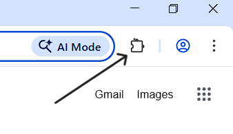
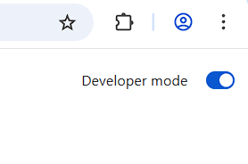
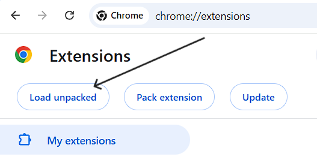
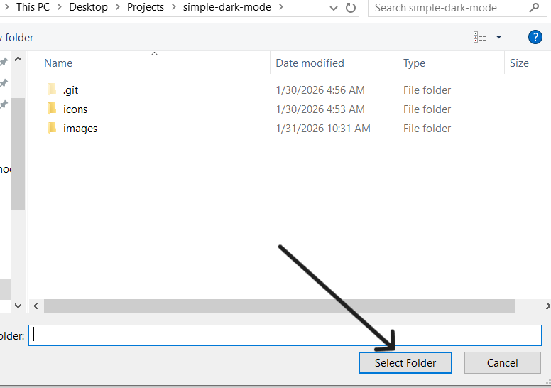
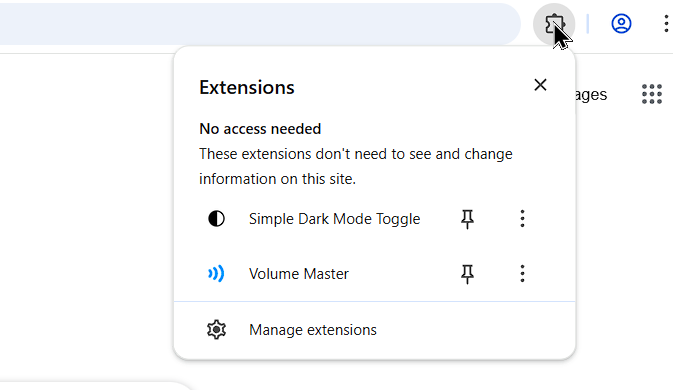
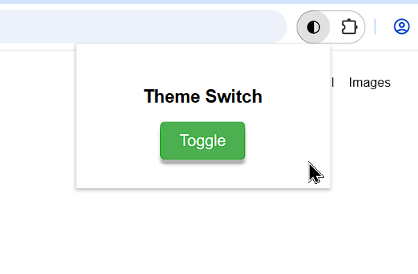
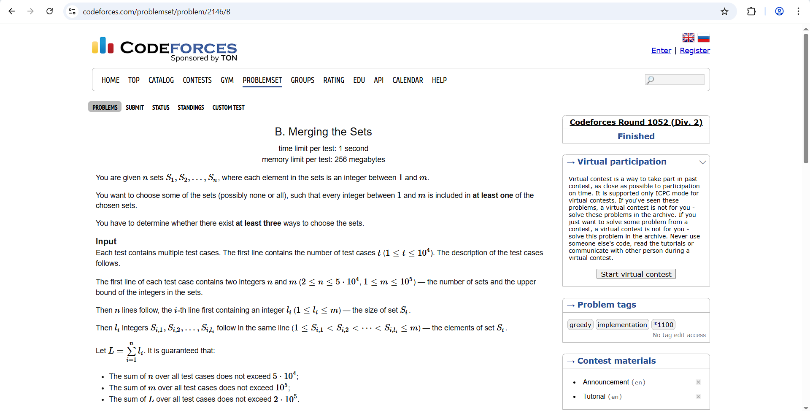
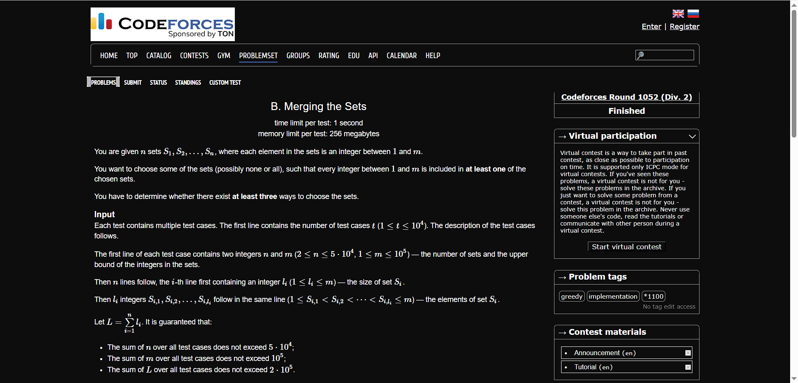

# Simple Dark Mode

# About

- Tap-Tap Makes stuff dark mode
- Refresh makes dark mode Bye-Bye

*Note:* Devs should spent extra time integrating a damn button to toggle dark mode

# Installation

1. Clone this repo

```
git clone https://github.com/StrandedDev/simple-dark-mode.git
```

2. Open Chrome and go to the extensions tab

<div align="center">
  
</div>

Or you can open this URL 

```
chrome://extensions/
```

4. Turn on **Developer mode** from Top Right corner.

<div align="center">
  
</div>

5. Click **Load Unpacked** option from Top Left side.

<div align="center">
  
</div>

6. Select the repo folder


<div align="center">
  
</div>


# Usage

<div align="center">
  
</div>


<div align="center">
  
</div>


# Screenshots

Before 

<div align="center">
  
</div>

After

<div align="center">
  
</div>
